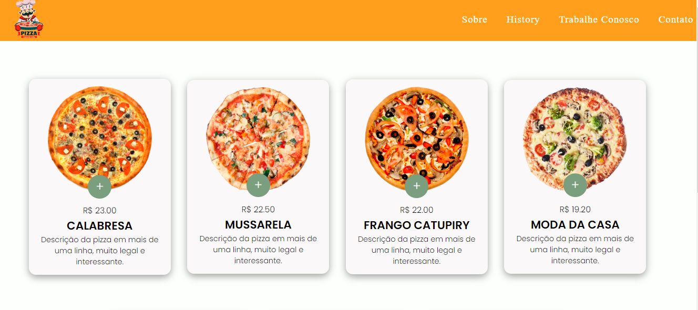
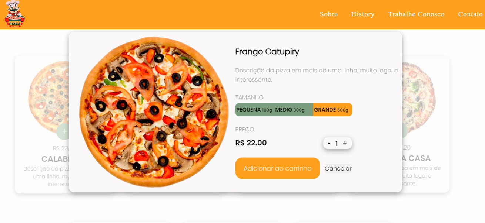
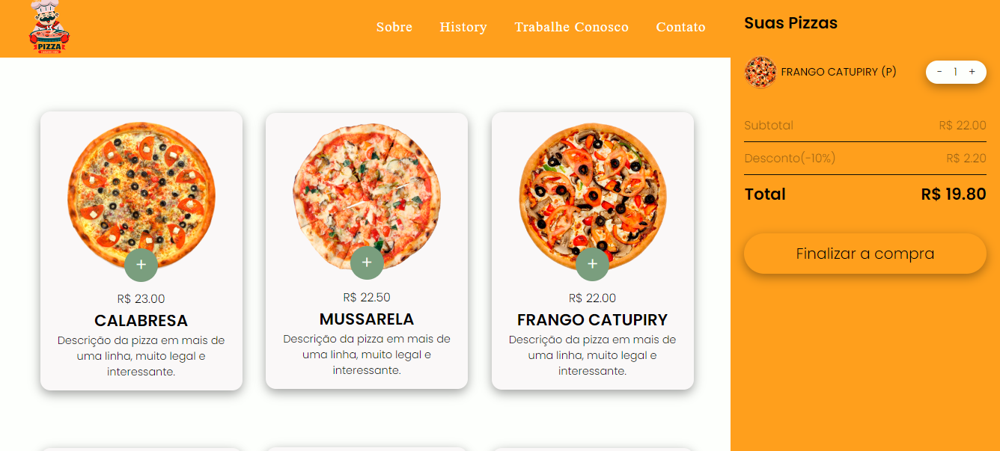

# E-comerce Pizzaria
 <h1 align="center">Refiz esse projeto com CSS SASS</h1>
 <h2 align="center">Programador Front-End</h2>
 
 

    
 

 

    
 

 

    
 

 ## 🚀 Tecnologias

 Esse projeto foi desenvolvido com as seguindes tecnologias:

 - HTML - CSS - CSS Sass 
 - JavaScript
 - GitHub
 - Visual Studio Code
 - Lógica de programação

 ## Projeto 
 <a href="https://kaesssantos.github.io/e-commerce/">Link do Projeto</a>

 Fiz esse projeto com o intuito de expandir minhas habilidades com as tecnologias citadas acima, e bastante logica de programação.

 ## :memo: Licença 

 Esse projeto está sobre a licença MIT.

